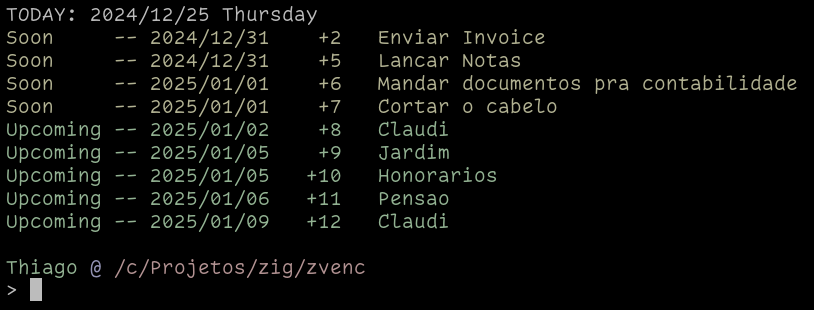

# zvenc

Scheduler / Agenda CLI.

This is a personal project.  I do not provide any support for it.


## Usage

Build it:

```sh
zig build
```

Add it to your `.zshrc`:

```sh
# zvenc
export PATH=$PATH:"<this_project_path>/zig-out/bin"
alias zvenc="zvenc ~/.zvenc.db"
zvenc
```

Now you'll get reminders whenever you open a terminal:




TODO: Add docs on how to add scheduler rules and agenda entries.

